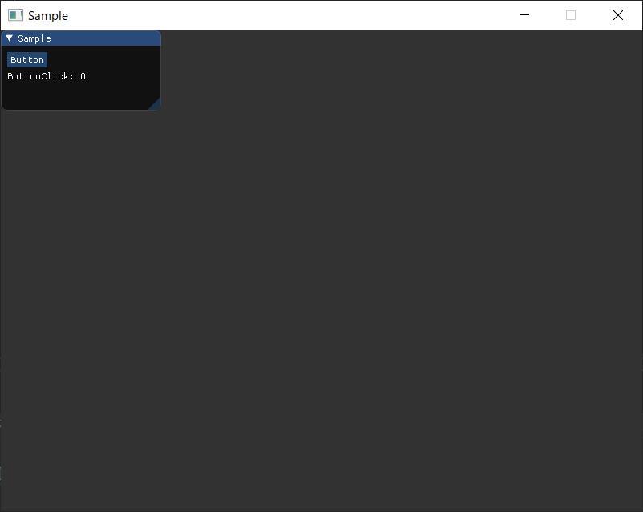

# Altseed2_ToolAuxiliary

[C#版Altseed2](https://github.com/altseed/Altseed2-csharp)のToolの実装をラップしてそれぞれのコンポーネントクラスとして扱うことのできるライブラリです。

## 使い方

基本的に`ToolHelper`クラスを使用します。
要素の追加には

```cs
ToolHelper.AddComponent(ToolComoinent component)
```

を用います。
`Button`や`Text`などの実装は`ToolComponent`クラスから派生しており，これらのコンポーネントを`AddComponent`で登録する事が出来ます。

要素の削除には
```cs
ToolHelper.RemoveComponent(ToolComponent component)
```

を用います。

`Button`や`Text`などのコンポーネントは追加するだけでは動かず，Altseed2のメインループ内に`ToolComponent.Update()`を入れることで初めて動きます。

## サンプルコード

```cs
using Altseed2;
using Altseed2.ToolAuxiliary;

namespace Sample
{
    class Program
    {
        static void Main(string[] args)
        {
            // Altseed2を初期化
            Engine.Initialize("Sample", 800, 600, new Configuration() { ToolEnabled = true });

            // ボタンのインスタンスを作成
            var button = new Button("Button");

            // ボタンのクリック数のカウンタ
            var count = 0;

            // テキストのインスタンスを作成
            var text = new Text("ButtonClick: 0");

            // ボタンクリック時のイベントを追加
            button.Clicked += (x, y) =>
            {
                count++;
                text.Message = $"ButtonClick: {count}";
            };

            // ウィンドウの名前を設定
            ToolHelper.Name = "Sample";

            // ウィンドウのサイズを設定
            ToolHelper.Size = new Vector2I(200, 100);

            // ToolHelperにコンポーネントを追加
            ToolHelper.AddComponent(button);
            ToolHelper.AddComponent(text);

            // メインループ
            while (Engine.DoEvents())
            {
                // ToolHelperを更新
                ToolHelper.Update();

                // Altseed2を更新
                Engine.Update();
            }

            // Altseed2を終了
            Engine.Terminate();
        }
    }
}
```

実行すると以下のようなウィンドウが表示されます。



Buttonと書かれたボタンをクリックするたびにテキストの数字が増えていきます。